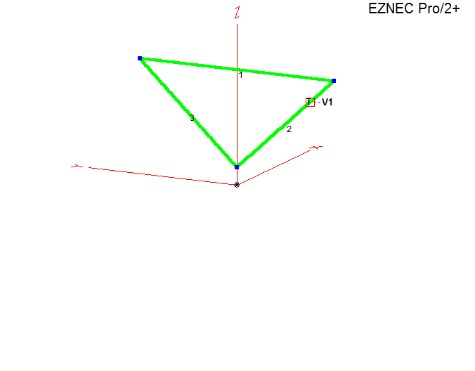
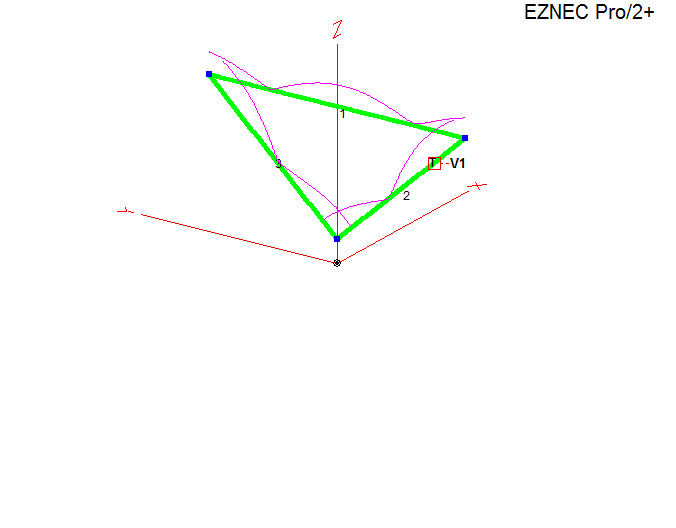
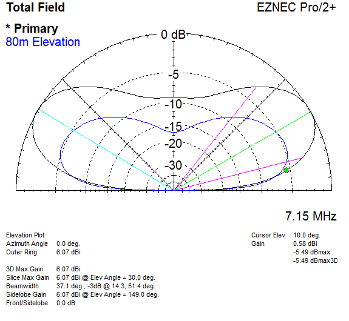

## Basic Antenna Models

Segemented for NEC-5 (even segments) at 75 MHz

- Dipole 40m at 10 m height
- Delta Loop Inverted Vertical at 20 m height 
- Vertical 43 ft Ground Mounted

## Delta Loop Plots

Inverted, fed for vertical polarization, low angle radiation for long distance communication

\
`View:`
|  |
| - |

\
`View 40m Currents:`
|  |
| - |

\
`40m and 80m Elevation Gain:`
|  |
| - |

\
`40m and 80m Elevation Gain at 10 degrees:`
|  |
| - |
