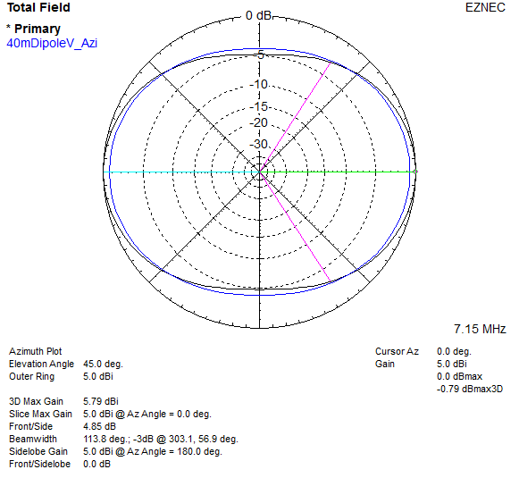
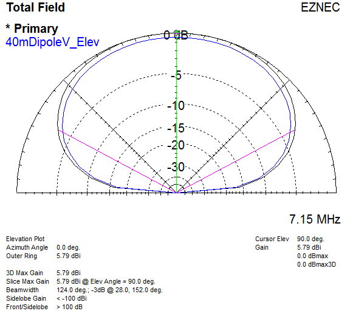

# 40m Dipole

A question on the amateur radio subreddit asked if a 40m dipole in a horizontal V conviguration at a (relative to wavelength) low height of 30 ft / 10 mH would work.
A lot of people took guesses and provided faulty information.
I decided to model and compare it to a straight dipole, guess what? Nearly no difference!

\
`Azimuth Plot:`
|  |
|-|

\
`Elevation Plot:`
|  |
|-|
