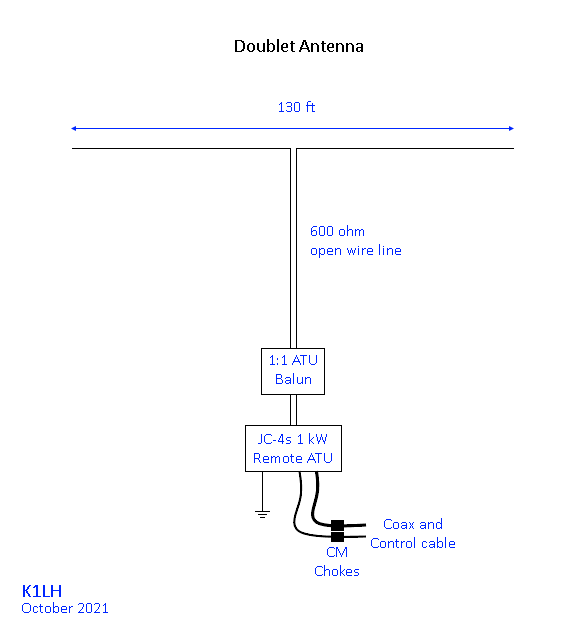

# 80m - 10m All Band Doublet
Perhaps the original all band antenna.

G5RV and ZS6BKW are doublets - just with specific lengths of wire and feeder, in the case of the BKW it provides a near 50 Ω match on several bands.

Prior to coax the open wire balanced feeder was directly connected to the tank circuit in vacuum tube amplifiers. Due to the low loss of high impedance balanced line (typically 450 to 600 Ω) the losses from high SWR on the line were not a concern.

In my opinion this is one of the best multi-band horizontal (and [vertical](../../Vertical/Doublet-4010/)) antennas there is due to simplicity, ability to operate on any frequency with minimal trade-off and good efficiency.

There are several ways to feed a doublet using modern rigs with 50 Ω coaxial output.
- Route balanced line into the shack to a balanced tuner or matching network
- Using paralleled coax lines to pass through walls to a balanced tuner or matching network
- 1:1 balun outside with very short (under 10 ft / 3m) low loss coax to tuner
- Remote tuner outside where the 50 Ω coax will always see low SWR (and minimal loss)

Most if not all remote ATUs are un-balanced, a high quality 1:1 balun (such as the ATU baluns offered by Balun Designs) must be used to force equal and opposite currents in the balanced feeder, and prevent common mode currents flowing on the coax and control cable shields.

As of November 2022 the last option is my current HF antenna setup. With the remote ATU control cable interfaced to the rigs ATU port, re/tunes are a simple button press and nearly instant.

\
`Antenna View:`
|  |
|-|

To have some certainty that my ATU is not being presented with any extreme impedance to match, I tuned the feeder by first cutting it a convenient length and then found I needed to add a 3 meter / 9 foot section to lift the impedance on the upper bands 15 to 10m. These are the values I measured with an antenna analyzer:

| Band | R Ω | X Ω  | SWR |
| ---- | --- | ---  | --- |
| 10m  | 162 | -93  | 4.4 |
| 12m  | 136 | -114 | 4.8 |
| 15m  | 56  | -178 | 13  |
| 17m  | 35  | -163 | 17  |
| 20m  | 52  | -259 | 28  |
| 30m  | 486 | 151  | 11  |
| 40m  | 102 | -442 | 41  |
| 60m  | 98  | 109  | 4.7 |
| 75m  | 137 | -445 | 32  |
| 80m  | 313 | -659 | 34  |
| 160m | 12  | -141 | 38  |

Here I can see the ATU will have a fairly good time matching, and why a 1:1 balun is a better choice than a 4:1. Using a 4:1 would result in very low impedances on some bands. See [Tuner Balun: 4:1 or 1:1?](http://www.karinya.net/g3txq/tuner_balun/).

On 160m its essentially a 1/4 wave dipole (far too short, minimum for a dipole to remain efficent is 3/8 wave, below this the impedance becomes very low), the balanced feeder transforms the impedance to 12 ohms which is just with-in range of the tuner, it does work but probably not very efficient. Even then I have worked some DX with it, including [T88WA](https://www.qrz.com/db/T88WA/) Palau and Japan across the Pacific during the morning greyline time.

A better option for 160m and 80m DX is to make the antenna dual purpose and operating it as a [Vertical T antenna](../../Vertical/T-Antenna/) by linking the feeders together and connecting them to one side of the 1:1 balun, and the radial system connected to the other.

The ATU/matching network's coax and control cables should also remain choked (so they do not become part of the antenna system), and shields grounded per NEC past the choke. Even though a Vertical T, Inverted L, or plain vertical are considered to be an un-balanced antenna, it's not perfectly un-balanced, and equal and opposite currents should still be forced via a balun between the two halves (antenna and radial system, buried or elevated) according to W8JI's [Counterpoise Systems](https://www.w8ji.com/counterpoise_systems.htm) page.

Ideally if feeder hangs vertical at least 60 ft (same length as 1/2 of the top section) this will work quite well, on 80m it'll be closer to a voltage fed T with the current maximum at the top. With the ATU 10 ft above ground this off-sets the feed-point slightly and lowers the impedance with-in the matching range according to the model.

With a little planning and investment in a good remote ATU + balun, and maybe a remote switching network for T antenna mode we potentially have one of the most versatile and efficient single antennas covering 160m to 10m.

[80-Meter Doublet](https://kv5r.com/ham-radio/2018-projects/80-meter-doublet/) - KV5R.

[10 Frequency Asked Questions about the All-Band Doublet](http://on5au.be/content/a10/wire/abd.html) - L. B. Cebik, W4RNL (SK).
