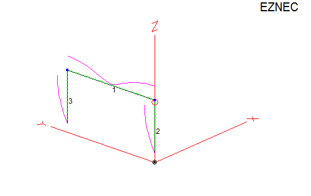
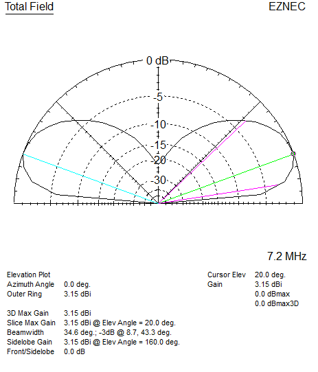
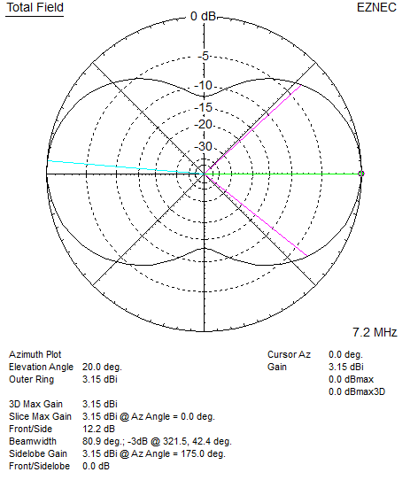
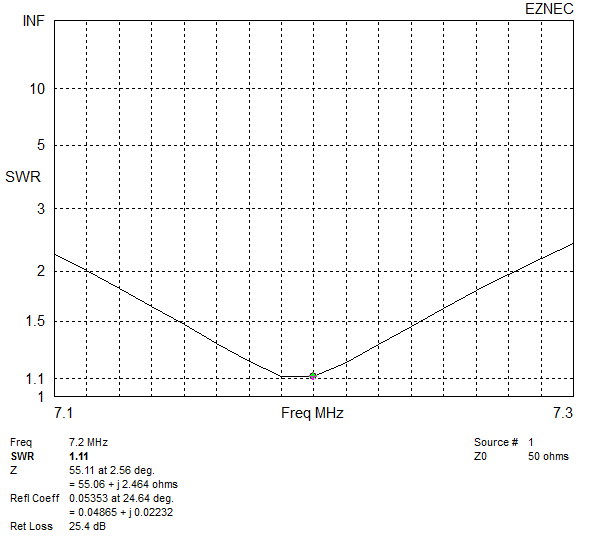
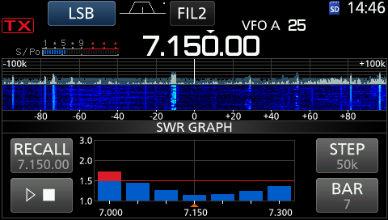

# Half Square

The Half Square array is a very simple and effective vertically polarized antenna which produces low angle radiation in a bi-directional pattern.

EZNEC and MMANA-GAL models. Note the EZNEC model has wire insulation defined, I found this resulted in the antenna being too short when I built it, changing the insulation thickness to 0.25mm was closer. Rule of thumb add some extra length for trimming.

- It behaves as two 1/4 wave verticals spaced 1/2 wave apart fed in phase, the wire joining the tops does not radiate and acts as a single wire transmission line.
- Since the current maximums on the vertical legs are at the tops, it is more immune to noise pickup (compared to ground mounted or based fed verticals) and less impacted by ground clutter.
- Does not need a radial field.
- Minimum height for good performance is just over 1/4 wavelength.
- It can be coax fed at one corner (with a current choke), or voltage fed at the bottom of one leg.
- Bandwidth is narrower due to it being a high Q antenna.
- Using two to get a uni-directional pattern - parasitic and phased see [Twin Half Square Arrays](../Phased-Array/Twin-Half-Square/).
- More info see [https://lonneys-notebook.blogspot.com/2020/04/40m-half-square.html](https://lonneys-notebook.blogspot.com/2020/04/40m-half-square.html).
- [Using the Half-Sqaure Antenna For Low-Band DXing](https://rudys.typepad.com/ant/files/antenna_halfsquare_array.pdf) - N6LF. 

\
`Antenna View (Current nodes shown):`
|  |
| - |

\
`Elevation plot over average ground:`
|  |
| - |

\
`Azimuth plot over average ground:`
|  |
| - |

\
`SWR Plot:`
|  |
| - |

\
`SWR Plot measured with IC-7300 (wire and coaxes losses smooth it out):`
\
\

