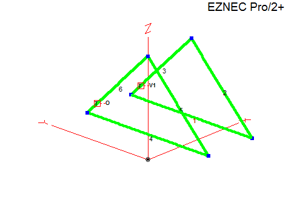
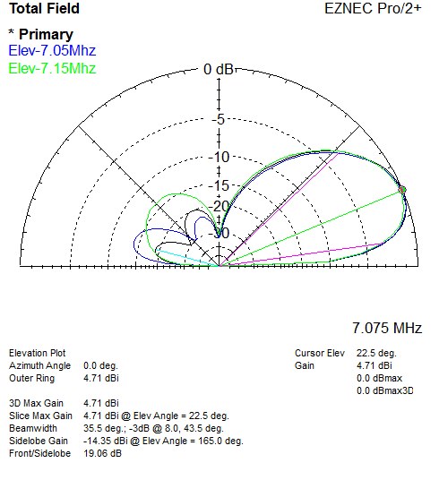
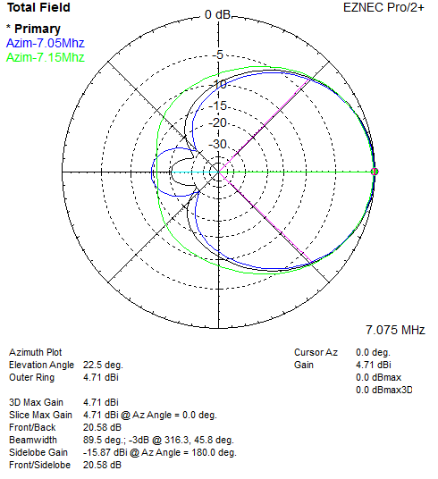
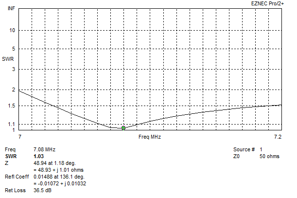

# 40m Two Element Delta Loop

Parasitic (driver + reflector), reversible, direct 50 ohm feed (no matching networks).

Optimized using [AutoEZ](https://ac6la.com/autoez.html), optimizing for gain and direct 50 ohm feed using equal length 75 ohm lines for convenience, one is fed (driver) the other is left open (reflector) which makes the switching network simple.

|  |
| - |

| Item | Measurement |
| ---- | ---- |
| Horizontal wire height above ground  | 3 m / 9.8 ft | 
| Horizontal wire length | 18.28 m / 60 ft |
| Height to apex above ground | 12.31 m / 40.3 ft |
| Side wire length | 13.04 m / 42.78 ft |
| Element spacing | 7 m / 23 ft |
| Feed position up side | 16.3% or 2 m / 6.5 ft |
| 75 Ω coax length from each element | 13.74 m / 45 ft (VF=1) |

\
Each 75 ohm line meets at a common point:
- 75 Ω line connected to the driver matches the system to 50 ohms.
- 75 Ω line to the other element is left open circuit resonating it as a reflector.
- Direction reversed by which line is open circuit and connected to the driven element.

The model uses bare 12 AWG copper wire, and VF of 1 for the 75 ohm coax. The model would need to be updated if using insulated wire and re-optimized, the VF of the coax being used would need to be measured with an analyzer and length multiplied by that number (e.g. 0.8 or what ever it is) to get the electrical length.

1:1 current baluns/chokes used where the coax connects to each loop, these could be made using some of the excess 75 ohm coax length as to not affect the electrical length or impedance of the lines.

\
`Elevation Plot:`
|  |
| - |

\
`Azimuth Plot:`
|  |
| - |

\
`SWR Plot:`
|  |
| - |

\
Further information at [https://lonneys-notebook.blogspot.com/2023/01/40m-two-element-delta-loop.html](https://lonneys-notebook.blogspot.com/2023/01/40m-two-element-delta-loop.html).