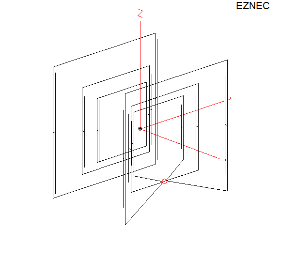
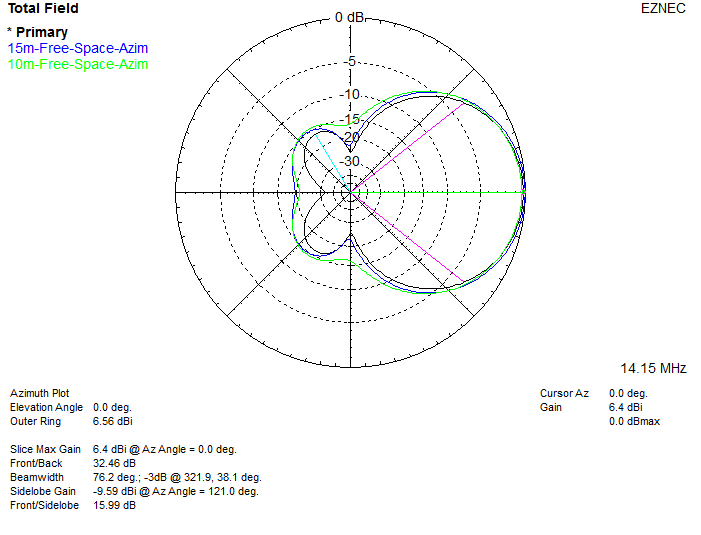

# Tri-Band CL Spider Quad

20/15/10m reduced size quad model. It's about 80% of full size at 4.4m per side on the 20 m elements.
The spreaders would be 3.53 m long. That's as small as we can go with capacitive loading as far as I can tell.

This model was a proof of concept for another ham who wanted to build reduced size multi band Quads. Model shows it's possible, but the mechanical, and electrical sensitivity to weather detuning it etc may make this impractical.

Feed-point impedance on each band is close to 100 ohms, 2:1 current balun would be needed at the common feedpoint on the 15 m DE.
Placing the model over real ground at 12 m height slightly raises the impedance and lowers the resonance.

The 15m elements reduce the 20 m bandwidth a little, but it's acceptable.

The element spacing is based on a [5-band full sized spider quad](http://dl2kq.de/mmana/lib/Multibands%20beams-Combined/5b_QQ_spider.gaa) model included with GAL-ANA as the starting point.

Free space model so the geometry is symmetrical (XYZ=0 is the geometric center, everything is equal distances from that point outward).
Use the change height function and real ground, will affect the tuning slightly.

The wires that do the tuning of the reflectors and DE are all set in the End 2 Z column, these are the ends of the cap hat wires:
\
`10m, DE wires 10 to 13, Ref wires 22 to 25`
\
`15m, DE wires 36 to 39, Ref wires 48 to 51`
\
`20m, DE wires 60 to 63, Ref wires 73 to 76`

The lengths of the cap hat wires appear quite critical, a 1 cm change on each wire makes quite a difference, especially on 10 m, in practice it might be a bit touchy to tune?

\
`Antenna View:`
|  |
| - |

\
`Azimuth Plot (Free Space):`
|  |
| - |
