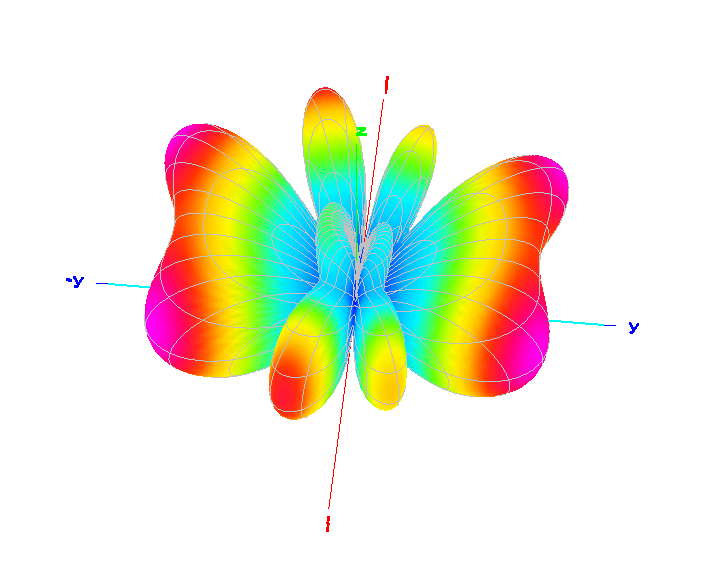

# Off Center Fed Dipole

These are a simple multi band antenna, 1/2 wave long on their fundamental (lowest frequency) band, the feed-point is usually between 33% and 20% from one end with a 4:1 current choke balun.

By using an offset feed-point the impedance is higher at around 200 ohms on the fundamental and harmonically related bands, this enables multi band option with coax feed.

Note: The antenna is un-balanced and needs a very good current choke at the feed-point, and maybe even further along the coax somewhere. Do not underestimate this issue, or think you can ignore it. Otherwise the coax shield will become part of the antenna system and radiate potentially causing RFI, increased noise pickup, and unpredictable pattern distortion. It can also be challenging to get enough choking resistnace below 40m/7MHz.

Due to the detuning effect the relative proximity of the ground at lower frequencies a trade-off is made where the low SWR point is at the bottom or just below the lower bands, and towards the top of the higher bands. The match is often close enough for limited range 3:1 internal rig tuners to "touch up", and close enough for the output matching networks in vacuum tube amplifiers to handle.

This was my HF wire antenna of choice before switching to a [doublet](../Doublet/Doublet-8010/).

Below are two methods of correcting the resonances so they line up better using a compensation coil near one end, or capacitor at the feed-point.

---

For more info see [https://lonneys-notebook.blogspot.com/2019/11/a-better-off-center-fed-dipole.html](https://lonneys-notebook.blogspot.com/2019/11/a-better-off-center-fed-dipole.html).

Detailed information about off center fed dipoles at [https://hamwaves.com/cl-ocfd/](https://hamwaves.com/cl-ocfd/), includes center loading network design to move 80m resonance up into the band, and adds 30m.

---

## Compensation Coil (CC)
Borrows the compensation coil idea from the popular EFHW (49:1 balun) designs. Antenna is shortened to bring the lower bands to resonance. The compensation coil is placed at or near one end where the current maximum is on 10m where the loading effect is needed most to correct the resonance on the higher bands, the effect is diminished lower in frequency where its further from the current maximum.

## Feed Point Loading (FPL)
Places a capacitor at the feed-point (in series with the log leg). Antenna is lengthened to bring the upper bands to resonance. The capacitor has a shortening effect on the lower bands bringing them to resonance, the effect is diminished on the higher bands where its not needed.

\
`Far Field 3D 20m (generated using GAL-ANA):`
|  |
| - |