# Twin Half Square Phased Arrays

Compares different feed systems for feeding a twin half square array.

Each can be made reversible.

- Parasitic (Driver/reflector for comparison)
- Simple Feed (SF) coax delay lines - no solution
- Current Forcing (CF)
- Opposite Voltage Fed (OVF)

Parasitic has the narrowest bandwidth, simple feed does not have a solution, current forcing maintains F/B (font to back ratio) over about 120 kHz, opposite voltage fed maintains F/B over 200 kHz or 2/3 of the 40m band - quite impressive!

Coax spec per Belden 9258 RG-8X
https://catalog.belden.com/techdata/EN/9258_techdata.pdf

More info at https://lonneys-notebook.blogspot.com/2020/12/phased-arrays-40m-twin-half-square.html

\
`Antenna View:`
| 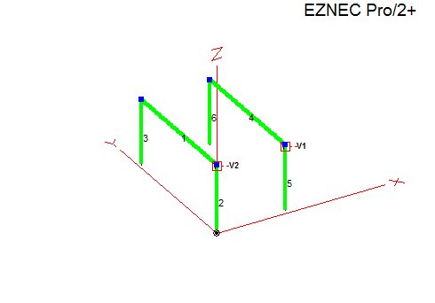 |
| - |

## Parasitic Driver / Reflector

VA7ST dimensions:
https://va7st.ca/2010/08/a-cheap-40m-dx-machine-the-twin-half-square-array/

Cebik's notes on twin half square arrays:
http://on5au.be/content/ao/ao11.html

Each half square can be configured with an specific equal length of coax meeting at a common point. Disconnecting and shorting one line resonantes the element as a reflector, this make the array easily reverasble with a remote controlled relay.

\
`Parasitic Elevation:`
| 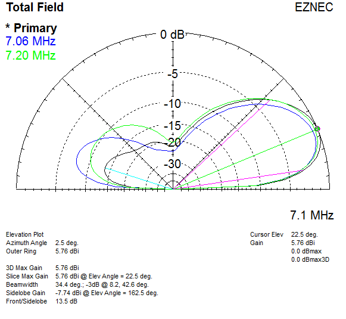 |
| - |

\
`Parasitic Azimuth:`
| 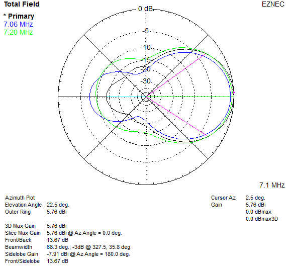 |
| - |

\
`Parasitic SWR:`
| 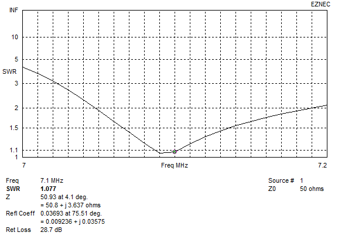 |
| - |

## Simple Feed (SF)

After creating a two source model in EZNEC, and entering the driving impedances into Arrayfeed it doesn't find a solution.

\
`Simple Feed:`
\
\
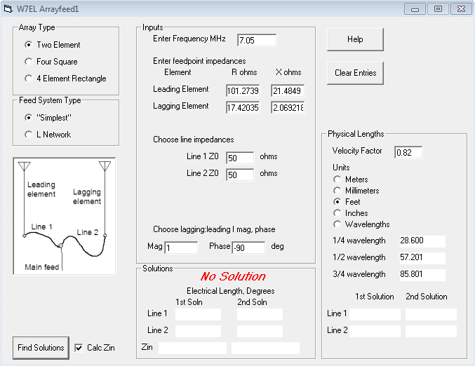

## Current Forcing (CF)

Uses Lewallen's current forcing feed system.
Phase shift performed by first L network calculated with Arrayfeed1.

Model based on info by N2PD From QST Jan 1998
http://techdoc.kvindesland.no/radio/ymse1/20061117162439060.pdf

Includes L match network for 50 ohm match.

\
`CF Elevation:`
| 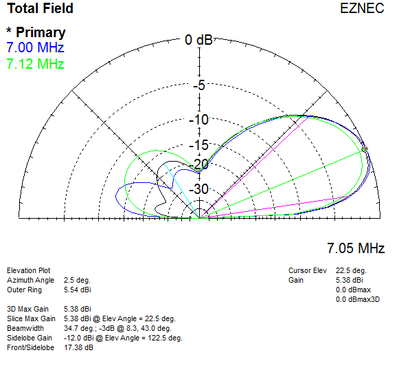 |
| - |

\
`CF Azimuth:`
| 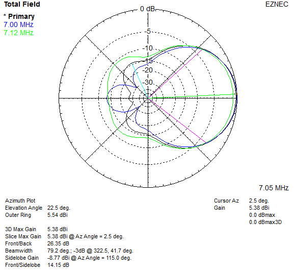 |
| - |

\
`CF SWR:`
| 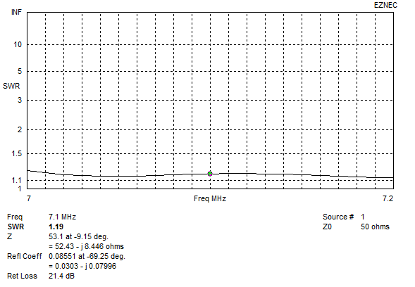 |
| - |

## Opposite Voltage Fed (OVF)

Opposite Voltage Fed (OVF) arrays were developed by Pekka Ketonen OH1TV. His site contains several examples in different configurations - https://oh1tv.fi/

- Each element has an electrical 1/2 wave line meeting at a common point
- One line’s polarity must be reversed
- VF/loss figures typical for RG-8X as an example
- Current chokes are required at element feed-points

First L network is a series loading inductor, the shunt is not needed and is open circuit represented by a 1M ohm resistor.

Second L network matches to 50 ohms, its output can be changed between V1 and V2 which reverses the direction of the array as it
simply changes which half wave line the loading inductor is inserted into.

\
`OVF Elevation:`
| 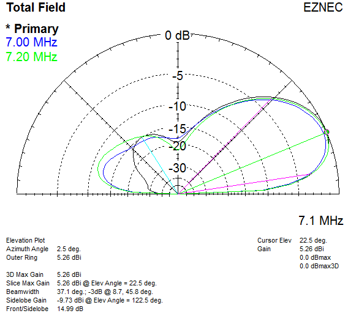 |
| - |

\
`OVF Azimuth:`
| 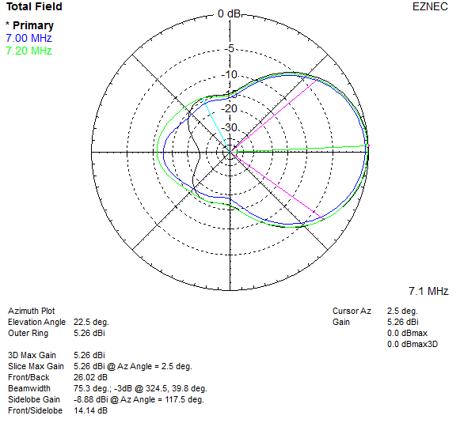 |
| - |

\
`OVF SWR:`
| 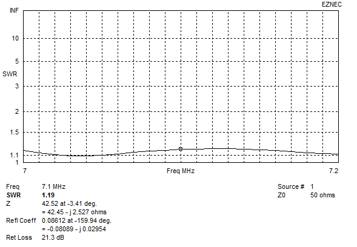 |
| - |
