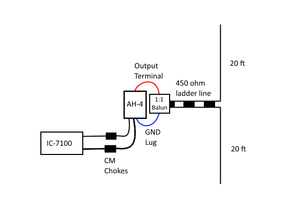
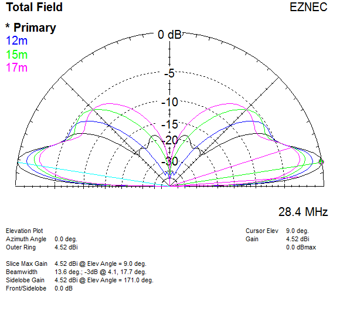
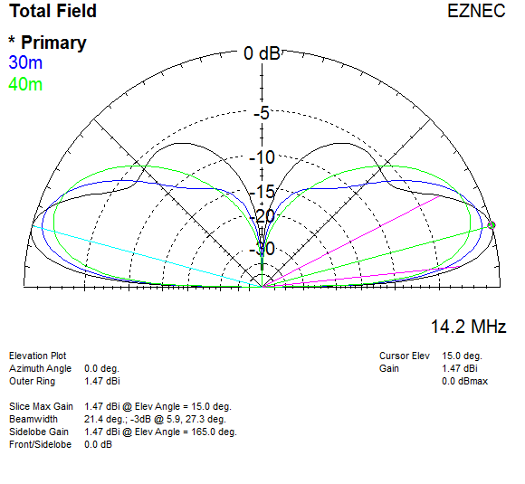
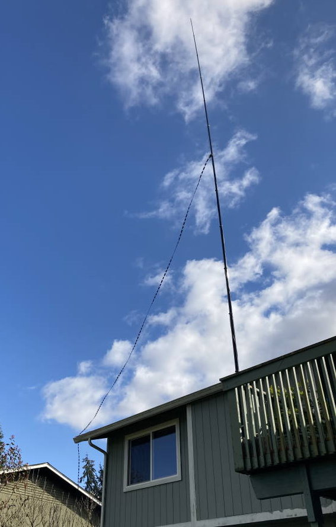
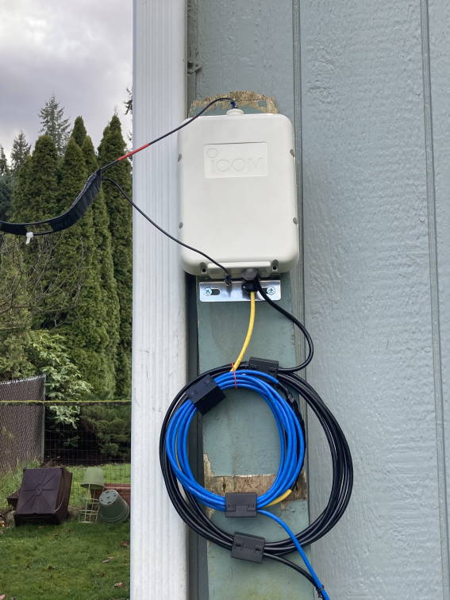

# 40 to 10m Vertical Doublet
40 ft center fed vertical.
450 ohm line to tuner, such as an AH-4.
40m through 10m operation.

2 x 5/8 on 10m (vertical EDZ), 4.5 dBi gain at 10 degrees when bottom wire is 10 ft above ground.
1/2 wave on 30m, should work "ok" on 40m.

Clean patterns with no high angle lobes!

For more info see [https://lonneys-notebook.blogspot.com/2021/03/40-ft-center-fed-vertical-40m-10m.html](https://lonneys-notebook.blogspot.com/2021/03/40-ft-center-fed-vertical-40m-10m.html).

Current chokes / baluns, most (if not all) remote automatic antenna tuners are unbalacned, to feed a balanced antenna the tuner to have a high quality 1:1 current choke or ATU balun beetween its output and the balanced line, and CM chokes on the coax and control cables. After I switched to a 1:1 ATU balun from Balun Designs in addition to CM chokes on the coax and control cable I got much better matches and an RFI issue on 17m went away.

The first version I only had CM chokes on the coax the control cable based on [AH-4_Design_and_Operation.pdf](https://www.hamoperator.com/HF/AH-4_Design_and_Operation.pdf).

Due to the potentially low impdeances presented on some bands a 4:1 is not recommended see [http://www.karinya.net/g3txq/tuner_balun/](http://www.karinya.net/g3txq/tuner_balun/).

\
`Antenna view:`
|  |
| - |

\
`Elevation plot 17m to 10m over average ground:`
|  |
| - |

\
`Elevation plot 40m to 20m over average ground:`
|  |
| - |

\
`Antenna mounted on 2nd level deck:`

\
`ATU and choke photo (first version), these are 3/4" Mix 31 snap on:`

