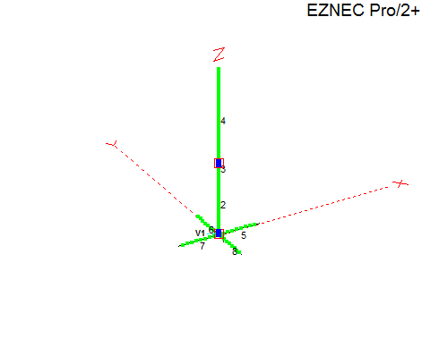
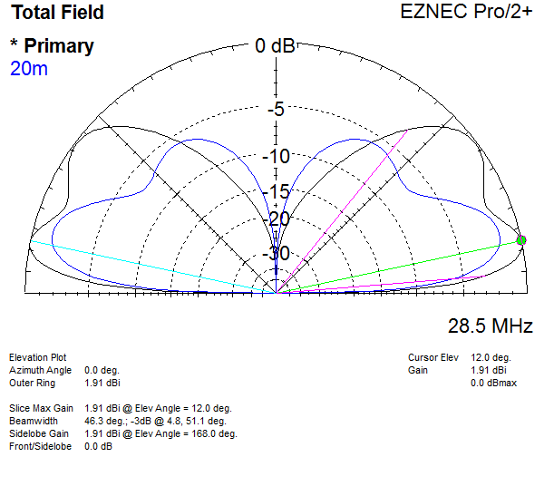
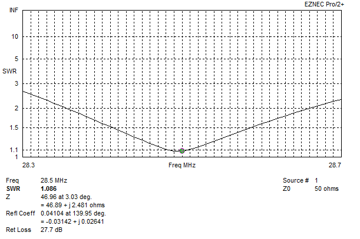
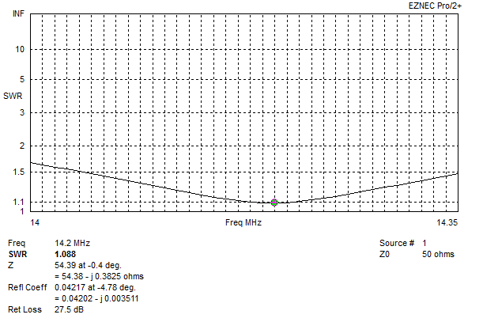
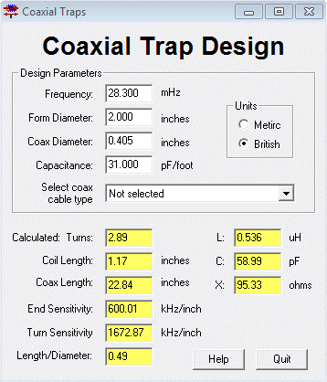

# Dual Band 10m/20m Ground Plane

## The Idea
The idea was a dual band vertical covering 10 and 20m bands using a trap, and one set of radials.

On 20m slightly over 3/8 wave with 75 ohm feed point.
On 10m 3/8 wave with 50 ohm feed point. Uses a coax trap based on RG-213 will handle 1500W, RG-58 traps will handle around 500W.

1/4 wave 61 ohm matching section on 20m matches 75 ohm to 50 ohm. Has no effect on 10m as it is a 1/2 wave..
60 ohm coax doesnt exist, RG-63 125 ohm does which can be parallled for 62.5, but is $280 for 100ft from the one place I could find that stocks it.

## WA7ARK Solution

[WA7ARK](https://www.qrz.com/db/WA7ARK) used [AutoEZ](https://ac6la.com/autoez.html) to find a solution where a 50 ohm match is found on each band.

If built a good 1:1 choke should be used at feedpoint since the short radials cause imbalance.

\
`Antenna View:`
|  |
| - |

\
`Elevation plot over average ground (20ft height):`
|  |
| - |

\
`SWR Plot 10m (bandwidth narrower than I'd like):`
|  |
| - |

\
`SWR Plot 20m:`
|  |
| - |

\
`10m Coax Trap (RG-213):`
\
\

\
[Coax trap calculator](../../../software/Coax-Trap/)