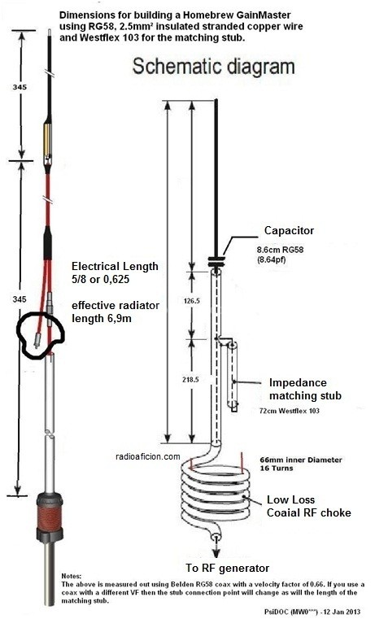
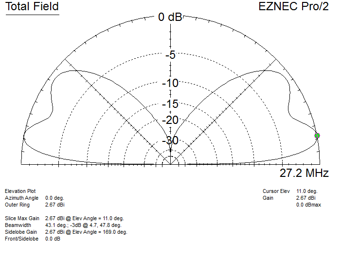
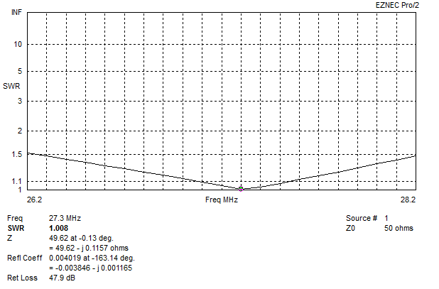

# Gain Master
Center fed 5/8 vertical, fairly broad band, made of wire and coax.

The in the model:
- Transmission line 1 is the length between where stub attaches and the capacitor.
- Transmission line 2 is the shorted stub length.

How does it work?

At the center of a split 5/8 wavelength dipole in EZNEC we see 180 + J 420 ohms:
- Top half is wire extending beyond capacitor, bottom half is the outside of the coax shield down to the choke.
- Capacitor in series with the center condutctor tunes out the inductive reactance leaving 180 ohms resistive.
- 50 ohm point is found where the stub attaches. The length of coax between the end of the stub (hanging off the side) and the capacitor forms the total stub length.
- A good example of this basic design is [K9YC's 1/2 wave vertical dipole](http://k9yc.com/VerticalDipole.pdf) made from coax, except being a 1/2 wave it doesnt need a matching network.

For more info see [https://lonneys-notebook.blogspot.com/2022/01/gain-master-antenna-model.html](https://lonneys-notebook.blogspot.com/2022/01/gain-master-antenna-model.html).

\
`Antenna Plan:`
|  |
| - |

\
`Elevation plot over average ground:`
|  |
| - |

\
`SWR Plot:`
|  |
| - |
