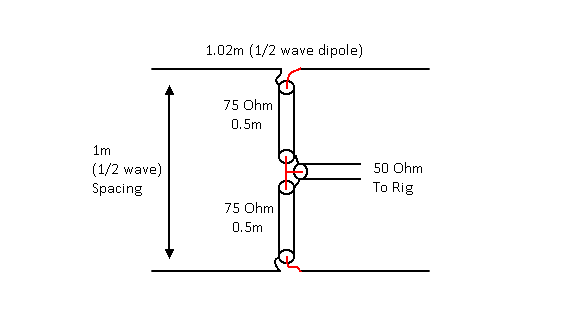
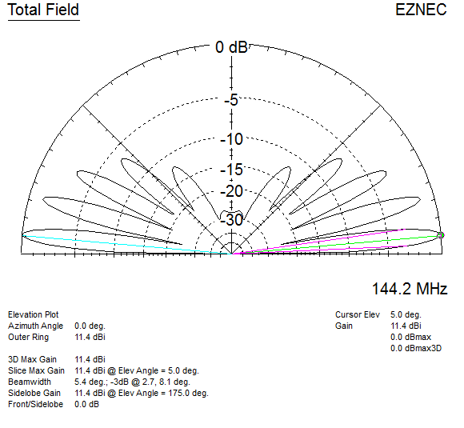
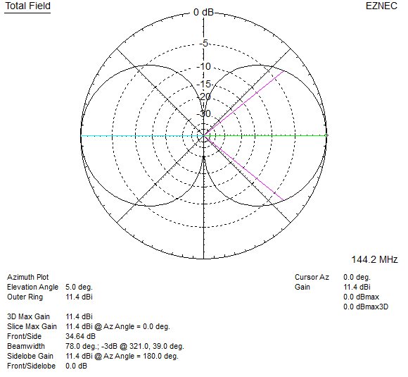
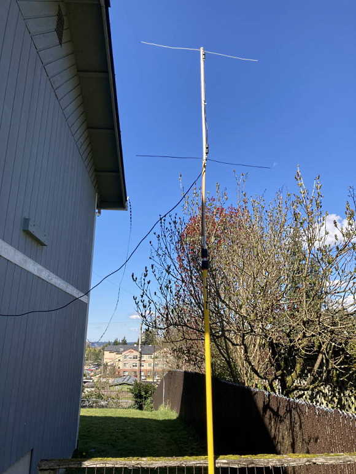

# 2m Horizontal Two Dipole Stack

Build it in an afternoon and get on 2m SSB horizontal, wire, coax, direct 50 ohm feed.

The two sections of 75 ohm coax combined with the driving impdeance of each dipole fed in phase results in a 48 ohm feed-point where they meet in the middle.

Ferrite (snap-on) chokes should be placed over the coax where it meets each dipole (stops the coax shield from radiating), the 50 ohm feeder coax can be run parallel down past the lower dipole and away.

For more info see [https://lonneys-notebook.blogspot.com/2021/04/2m-horizontal-dipole-stack.html](https://lonneys-notebook.blogspot.com/2021/04/2m-horizontal-dipole-stack.html).

\
`Antenna View (not to scale):`
|  |
| - |

\
`Elevation plot 6 meters / 20 ft height above average ground:`
|  |
| - |

\
`Azimuth plot 6 meters / 20 ft height above average ground:`
|  |
| - |

\
Test version I built out of stuff I had laying around. Worked well with other horizontal stations on 2m SSB.
\
\
