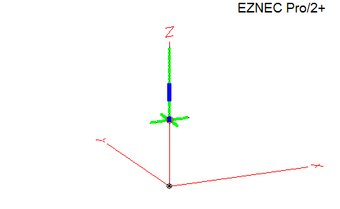
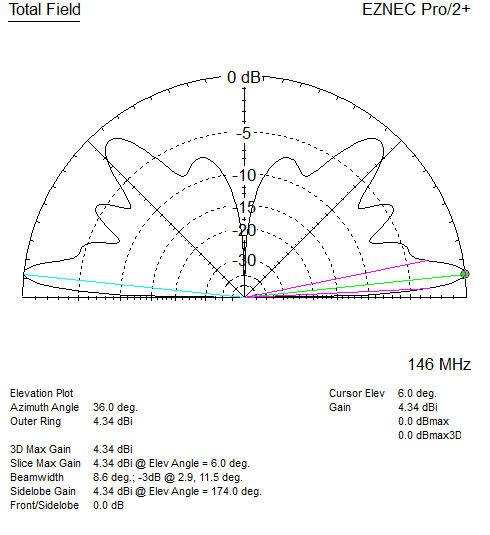
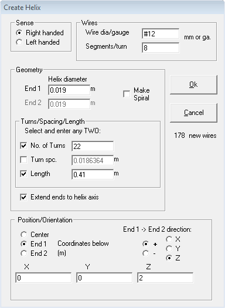

# 2m 5/8 over 1/4 wave vertical ground plane

Hustler CG-144 is one example of this type of antenna.

Phasing coil from [Improving the Super-J](https://www.hamradio.me/antennas/improving-the-super-j.html), this appears to be fairly close to the CG-144 measurements.

Issues: Bandwidth is narrow in the model (~2 MHz < 1.5:1), maybe because 12 AWG wire to keep it simple.

\
`Antenna View:`
|  |
| - |

\
`Elevation Plot 2 meters height above average ground:`
|  |
| - |

\
`Create the coil (per Super-J article measurements) with Create Helix function in EZNEC:`

