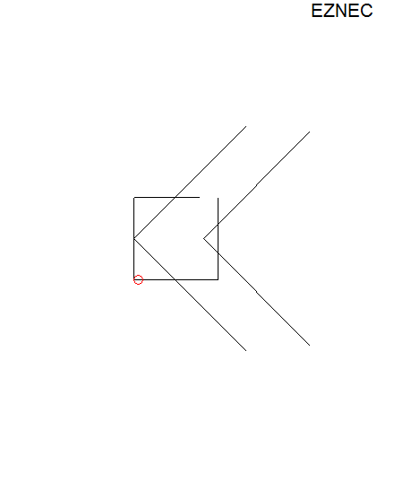
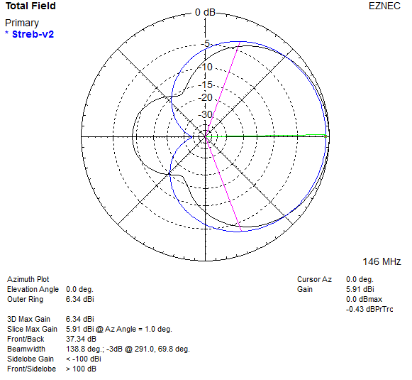
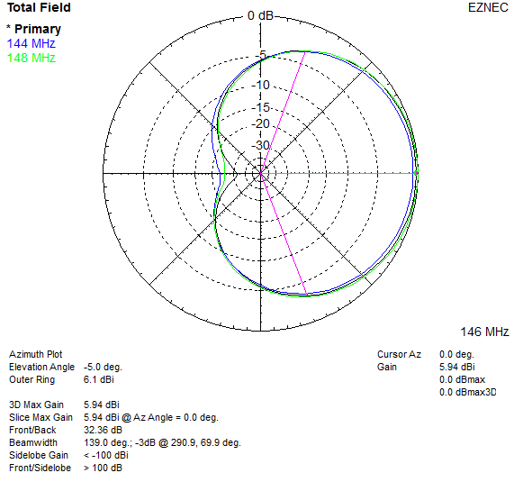
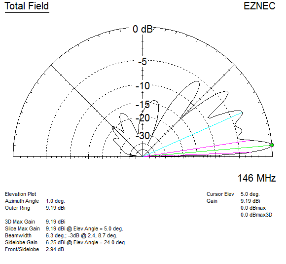

# STREB

The STREB VHF Compact Beam by Bert Looser ZL4IV is a 2m antenna which appeared in October 1992 BREAK-IN, the official amateur radio journal published by [NZART](https://www.nzart.org.nz). See [STREB-PAGE-1.pdf](STREB-PAGE-1.pdf), and [STREB-PAGE-2.pdf](STREB-PAGE-2.pdf).

2m-STREB-v1.ez original per the article, except parasitic elements are in same plane with 50 mm spacing.

2m-STREB-v2.ez / 2m-STREB-v2.weq optimized using [AutoEZ](https://ac6la.com/autoez.html).

For more info see [https://lonneys-notebook.blogspot.com/2021/07/streb-vhf-compact-beam-revisited.html](https://lonneys-notebook.blogspot.com/2021/07/streb-vhf-compact-beam-revisited.html).

\
`Antenna View:`
|  |
| - |

\
`Azimuth plots v1 (original) vs v2 (optimized):`
|  |
| - |

\
`Azimuth plots at band edges:`
|  |
| - |

\
`Elevation plot vertically polarized 5 meters / 15 ft height:`
|  |
| - |