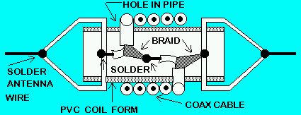
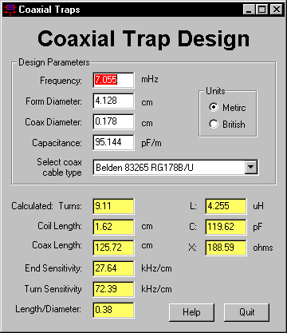

# Coax Trap Design

[VE6YP Homepage](https://www.qsl.net/ve6yp/)

https://www.qsl.net/ve6yp/CoaxTrap.html

https://www.qsl.net/ve6yp/coaxtrap.zip 

The Coax trap program computes design parameters for the construction of coaxial traps for HF usage. Typically these are constructed from PVC tube and RG58/59 coax. 
\
\

\
\
Only 4 parameters need to be known: the design operating frequency, the coil form diameter, the coax diameter and the coax capacitance per foot. Coax characteristics are provided for various Belden cables.
\
\

---

Do not use foam dielectric coax, with the tight turns needed to form the coil the center conductor will migrate through the foam and may eventually cause a voltage break down or short damaging the trap.

More information about traps (W8JI): https://www.w8ji.com/traps.htm 

Building coaxial cable traps (W8WWV): http://seed-solutions.com/gregordy/Amateur%20Radio/Experimentation/CoaxTrap.htm
